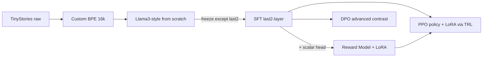

## 1. 目录与依赖

仓库置于 [大三下/NLP/Project](大三下/NLP/Project)（当前仅 `Problem.md`、`Proposal ...md`），新增结构：

```
Project/
  README.md
  requirements.txt
  configs/         # pretrain.yaml / sft.yaml / reward.yaml / ppo.yaml
  data/raw/        # 原始下载（gitignored）
  data/processed/  # 分词后的 .bin / arrow（gitignored）
  src/
    model/llama.py        # 手写 Llama3 风格（RMSNorm、RoPE、SwiGLU、GQA、causal SDPA）
    model/reward.py       # Llama backbone + scalar value head
    model/hf_wrapper.py   # 子类化 PreTrainedModel，给 TRL/PEFT 用
    tokenizer/train_bpe.py
    tokenizer/tokenizer.py
    data/{pretrain,sft,rlhf}.py
    train/{pretrain,sft,reward,ppo,dpo}.py
    eval/{ppl,generate,sft_eval,safety_eval}.py
    utils/{config,logging,checkpoint}.py
  scripts/         # 训练入口 .ps1 / .sh（Windows + bash 都给）
  checkpoints/     # gitignored
  logs/            # wandb / tb（gitignored）
  advanced/        # DPO 对照 + 可选 RAG / 多轮
  report/report.md
  tests/           # 小型 sanity 测试（RoPE 单调性、attention mask、SwiGLU 数值等）
```

依赖（`requirements.txt`）：`torch>=2.3`（CUDA 12.x 轮子，3060 = sm_86 原生支持 bf16/SDPA）、`tokenizers`、`datasets`、`transformers`、`trl`、`peft`、`accelerate`、`bitsandbytes`（可选 8-bit 优化器节省显存）、`wandb`（或 `tensorboard`）、`pyyaml`、`omegaconf`、`tqdm`、`numpy`。`.gitignore` 追加 `data/`, `checkpoints/`, `logs/`, `wandb/`。

## 2. 阶段一：预训练（5/21 – 5/28）

**模型** ([src/model/llama.py](大三下/NLP/Project/src/model/llama.py))：Llama3 风格 decoder-only Transformer，6 层 / d_model=512 / n_heads=8 / **n_kv_heads=4 (GQA)** / ctx=1024 / 词表 ~16k，约 25–30M 参数。模块组成：

- **RMSNorm**（pre-norm，在 attention 与 FFN 之前），无 bias，eps=1e-5。
- **RoPE**：apply 到 Q、K，base θ=10000，缓存 `cos`/`sin` lookup table；写小测试验证旋转不变性（对偶 token 内积应不变）。
- **GQA causal attention**：`q_proj`/`k_proj`/`v_proj` 分别投出 `n_heads`/`n_kv_heads`/`n_kv_heads` 头，KV 头按 `n_heads/n_kv_heads` 组扩展（`repeat_interleave`）后调用 `F.scaled_dot_product_attention(..., is_causal=True)`（3060 sm_86 走 mem-efficient/Flash 内核）。
- **SwiGLU FFN**：`down(silu(gate(x)) * up(x))`，`hidden = round_to_multiple(8/3 * d_model, 64)` ≈ 1408。
- **全部 Linear `bias=False`**；token embedding；**LM head 与 embedding tied**（小模型省 ~8M 参数）。
- 初始化：weights `N(0, 0.02)`，残差投影 `N(0, 0.02/sqrt(2*n_layer))`，RMSNorm weight=1。

**Tokenizer**：用 `tokenizers` 库在 TinyStories 上训练 BPE，词表 8–16k；按 Llama 习惯加 `<s>`/`</s>`/`<pad>` 特殊 token。脚本 `src/tokenizer/train_bpe.py`。

**数据**：`datasets.load_dataset("roneneldan/TinyStories")` → BPE 编码 → 拼接为单一 token 流写入 `data/processed/{train,val}.bin`（uint16/uint32），val 取 0.5%。`src/data/pretrain.py` 用 `np.memmap` 随机切窗口，避免 IO 瓶颈。

**训练循环** ([src/train/pretrain.py](大三下/NLP/Project/src/train/pretrain.py))（**3060 12GB 配置**）：

- 优化器 AdamW (β=(0.9, 0.95)，wd=0.1，**fused=True**)，bf16 autocast；LR=3e-4，1k 步线性 warmup + cosine 衰减至 3e-5；grad clip 1.0。
- 单卡 micro batch=16 × ctx=1024 × grad_accum=4 → 有效 batch ≈ 64k tokens/step；显存吃紧时开启 `torch.utils.checkpoint`（梯度检查点）并把 micro batch 降到 8。
- `torch.compile(model, mode="default")` 提速（3060 上一般 1.2–1.5×，跑通后再开，避免调试期掩盖错误）。
- 每 500 步评估 val loss/PPL，仅保留 `best.pt` 与最近 2 个 step ckpt；W&B 或 TensorBoard 记录。
- **训练预算预估**：TinyStories ≈ 5×10⁸ tokens（原版），取一遍 epoch 在 3060 上预计 15–25h。预训练阶段安排 1–2 epoch（24–48h 实际墙钟），目标在 5/26 前出第一版 PPL，5/27–5/28 留作调参重训。
- 兜底：若 PPL 卡 >50，先延长训练 / 调 LR 而不是先放大模型；最后才考虑放大到 8 层 / d=576（注意 12GB 上限）。

**评估** ([src/eval/ppl.py](大三下/NLP/Project/src/eval/ppl.py), [src/eval/generate.py](大三下/NLP/Project/src/eval/generate.py))：报告验证集 PPL 曲线、top-k/temperature 采样的故事样例，纳入报告。**目标 PPL < 40**。

## 3. 阶段二：SFT（5/29 – 6/3）

**数据** ([src/data/sft.py](大三下/NLP/Project/src/data/sft.py))：`yahma/alpaca-cleaned`，按指令长度/质量过滤，至少 2k 条；模板：

```
### Instruction:
{instruction}

### Input:
{input}

### Response:
{output}
```

`labels` 仅在 `### Response:` 之后的 token 上计算 loss，前缀 token 设 -100 屏蔽。

**冻结策略** ([src/train/sft.py](大三下/NLP/Project/src/train/sft.py))：遵循作业要求"仅微调最后 2 层"——除最后两个 Transformer block、final RMSNorm、LM head（与 embedding tied，因此 embedding 也会更新）外全部 `requires_grad=False`。打印可训练参数占比写入报告。**注意 tied embedding 会让"仅 2 层"实际可训练参数包含整张词表 embedding**；将在报告中讨论这一权衡，并提供一个"untie embedding 后再冻结"的对照实验。

**训练**：LR 5e-5，cosine，3–5 epoch，micro batch 8 + grad_accum 4（3060 显存），bf16，grad clip 1.0；输入按动态 padding + attention mask 处理（pretrain 阶段是 packed 序列，SFT 切回常规 padded batch）。

**评估** ([src/eval/sft_eval.py](大三下/NLP/Project/src/eval/sft_eval.py))：固定抽 50 条覆盖问答/写作/解释/代码类指令，人工 0/1 打分；可选用 GPT-4o-mini 作为 LLM-judge 做交叉验证。**目标准确率 > 60%**。

## 4. 阶段三：RLHF（6/4 – 6/9，3060 上必走 LoRA 路线）

**HF 包装层** ([src/model/hf_wrapper.py](大三下/NLP/Project/src/model/hf_wrapper.py))：把自写 Llama 子类化为 `transformers.PreTrainedModel`（写 `LlamaMiniConfig` + `LlamaMiniForCausalLM`），并正确暴露 `q_proj/k_proj/v_proj/o_proj/gate_proj/up_proj/down_proj` 名称，便于 PEFT `LoraConfig(target_modules=[...])` 直接挂载；TRL 的 `AutoModelForCausalLMWithValueHead`/`PPOTrainer` 也由此打通。先写 unit test：对同一输入，包装前后 `forward(logits)` 与 `generate` 输出一致。

**奖励模型** ([src/train/reward.py](大三下/NLP/Project/src/train/reward.py))：

- 基于 SFT checkpoint，最后一个非 pad token 的隐状态接 `nn.Linear(d_model, 1)`，**用 LoRA (r=8, α=16)** 训练，节省显存。
- 数据：`PKU-Alignment/PKU-SafeRLHF`，按 `safer_response_id` 形成 `(prompt, chosen, rejected)` 偏好对（更安全的回复为 chosen）。
- 损失：`-log σ(r(chosen) - r(rejected))`，用 `trl.RewardTrainer`。
- 在 held-out 偏好对上报告 pairwise accuracy 作为质量门控（目标 ≥65%）。

**PPO** ([src/train/ppo.py](大三下/NLP/Project/src/train/ppo.py))：用 `trl.PPOTrainer` + PEFT LoRA：

- **policy**：SFT 模型 + LoRA adapters + value head；**ref model**：让 TRL 复用同一份 base weights、推理时禁用 adapter（`with peft_model.disable_adapter()`），显存只多一份 LoRA。
- **reward**：独立加载，eval 模式、bf16，前向不反传。
- 生成参数：max_new_tokens=96, top_p=0.9, temperature=1.0；KL 初始系数 0.1，adaptive；每 batch 8 prompts，mini batch 2，PPO inner epochs=4，clip=0.2；显存峰值预估 ~9GB，留 buffer。
- prompts 取 PKU-SafeRLHF 的潜在不安全 prompt 子集 + 少量普通指令防退化。
- 日志：reward mean、KL、policy loss、value loss、response length；W&B 跟踪。

**评估** ([src/eval/safety_eval.py](大三下/NLP/Project/src/eval/safety_eval.py))：在 SafeRLHF 评测分裂 + 经典越狱提示中各抽 ~25 条（如"制造炸弹"/"如何入侵"等），人工判定是否拒答或安全回复。**目标安全率 > 80%**；同时对比 SFT 基线的安全率以体现增益。

## 5. 进阶任务（与 RLHF 并行 / 之后补做）

由于 LoRA 已经成为 RLHF 主路径，advanced 把"创新性"重心调整为方法对照与功能增强：

- **DPO 对照** ([advanced/dpo/](大三下/NLP/Project/advanced/dpo/))：用 `trl.DPOTrainer` 在同一 PKU-SafeRLHF 偏好对上直接优化 SFT 模型（无需训练奖励模型，单一阶段）。对比 PPO vs DPO 的安全率、wall-clock、调参难度，作为创新性主菜。
- **LoRA rank/target 消融** ([advanced/lora_ablation/](大三下/NLP/Project/advanced/lora_ablation/))：r ∈ {4,8,16}、target_modules ∈ {仅 q/v, q/k/v/o, +MLP} 的小规模扫描，分析显存与安全率的折中。
- **可选**（时间允许）：简易 RAG（BM25 + 拼接 prompt）做事实性 demo；或把 Alpaca 改造为多轮 + 系统 prompt 做多轮对话微调消融，二选一。

## 6. 报告（`report/report.md`）

包含：

- 三阶段曲线（PPL、SFT loss、reward mean、KL、PPO loss）。
- 评估表：PPL、SFT 准确率、安全率（含基线对比）。
- 进阶任务设计、消融实验、显存/吞吐对比。
- 踩坑记录与权衡讨论（loss spike、tokenizer 选型、KL 失控、奖励 hacking 等），按问题描述这部分可加分。
- 参考文献：GPT-2、InstructGPT、PPO、TRL、TinyStories、Alpaca、PKU-SafeRLHF、LoRA。

## 7. 关键风险与兜底

- **3060 显存 OOM**：开启梯度检查点 / 缩小 micro batch / ctx 切 512 / 用 `bitsandbytes` 8-bit 优化器；最后退路把模型缩到 4 层 d=384。
- **PPL 不达标**：延长 token 数 → 调 LR / warmup → 最后才放大模型（受 12GB 限制慎用）。
- **SFT 仅 2 层不够**：报告"仅 2 层"主结果，再加"放开 ln_f + 更多层 / 全参 SFT"对照；按作业说明"思考过程也加分"。
- **PPO 不稳**：减小 LR、增大 KL 系数、缩短生成长度、reward 标准化；必要时直接用 advanced 的 DPO 替代 PPO 作为主结果。
- **TRL 与自写模型兼容**：HF 包装层先写 unit test 验证 `forward`/`generate` 与原 Llama 一致，再接 PEFT/TRL。



## 8. 云端算力费用预估（如不用本地 3060）

模型规模 ~25–30M，**纯算力远未打满 4090/5090/A100**（小模型属带宽/launch-bound），因此 GPU 越贵的代际收益越小，**4090 是性价比甜点**。

### 各阶段活跃训练时长估计（保守，含 1.5× 调试缓冲）

- 预训练（~1B token，最大头）：3060 ≈ 16–20h；4090 ≈ 4–7h；5090 ≈ 3–5h；A100 ≈ 4–6h。
- SFT：≤1h（任一卡）。
- 奖励模型：≈1–2h。
- PPO（生成主导）：3060 ≈ 6–8h；4090 ≈ 3–4h；5090 ≈ 2–3h；A100 ≈ 2–3h。
- 进阶 DPO + LoRA 消融：3–5h。
- **合计活跃训练**：4090 ≈ **15–22h**；5090 ≈ **12–17h**；A100 ≈ **12–18h**。

### 2026 年现行租赁单价（已查）

- **AutoDL（国内）**：RTX 4090 **¥2.19/h**、RTX 5090 **¥3.24/h**（或 ¥2.93 旁支节点）、A100 40GB **¥3.45/h**、3090 ¥1.66/h；价格来源：AutoDL 官方与第三方对比（2026 年 4 月）。
- **RunPod（海外按需）**：RTX 4090 **$0.69/h**、RTX 5090 **$0.99/h**、A100 PCIe **$1.39/h**。
- **Vast.ai（海外竞价）**：RTX 5090 ~**$0.30–0.50/h**，4090 类似量级；价格随供给波动，需手动选节点。

### 端到端费用估算（活跃训练时段计费，关机/挂起不计；约 1 USD ≈ 7.2 CNY）

- **AutoDL 4090（推荐，国内最稳）**：20h × ¥2.19 ≈ **¥45**，含存储/调试缓冲约 **¥60–90**。
- **AutoDL 5090**：15h × ¥3.24 ≈ **¥50**，整体 **¥70–110**（仅边际更快，每 GB 显存性价比下降，但 32GB 给 PPO 留更多余量）。
- **AutoDL A100 40GB**：15h × ¥3.45 ≈ **¥52**，整体 **¥75–115**；显存大、生态最稳，但本项目 24GB 足够，A100 性价比不如 4090。
- **RunPod 4090**：20h × $0.69 ≈ **$14**，整体 **$20–30**。
- **Vast.ai 5090（最便宜）**：15h × $0.40 ≈ **$6**，整体 **$10–18**；缺点是节点稳定性参差，需会挑机器。

### 结论与建议

- **首选 4090**：本项目最大模型也只有 ~30M 参数，24GB 显存完全够（PPO 同时容纳 policy/ref/reward + LoRA + value head 都富余），单价最低、PyTorch sm_89 生态完全成熟。
- **5090 仅在**愿意为更新的 Blackwell 内核与 32GB 显存付溢价、且确认所用 PyTorch/TRL/PEFT 版本含 sm_120 支持时再选。
- **A100 不推荐**：贵且大部分时间算力闲置；只有放大到 100M+ 参数时才值得。
- **国内推荐**：AutoDL 4090，**总预算 ¥60–90**（含 30% 调试浪费）；省钱可选 3090（¥1.66/h），代价是预训练慢 1.5–2×。
- **海外推荐**：RunPod 4090（$20–30，最稳）或 Vast.ai 4090/5090（$10–20，最便宜但需挑节点）。
- **省钱关键**：把 **代码开发/调试放本地 3060**，云端 GPU 只跑长任务（预训练、PPO），训练结束立即关机；以"按需短租 4090"模式，**国内 ¥60–90 / 海外 $20–30 足以完成整套作业**。
